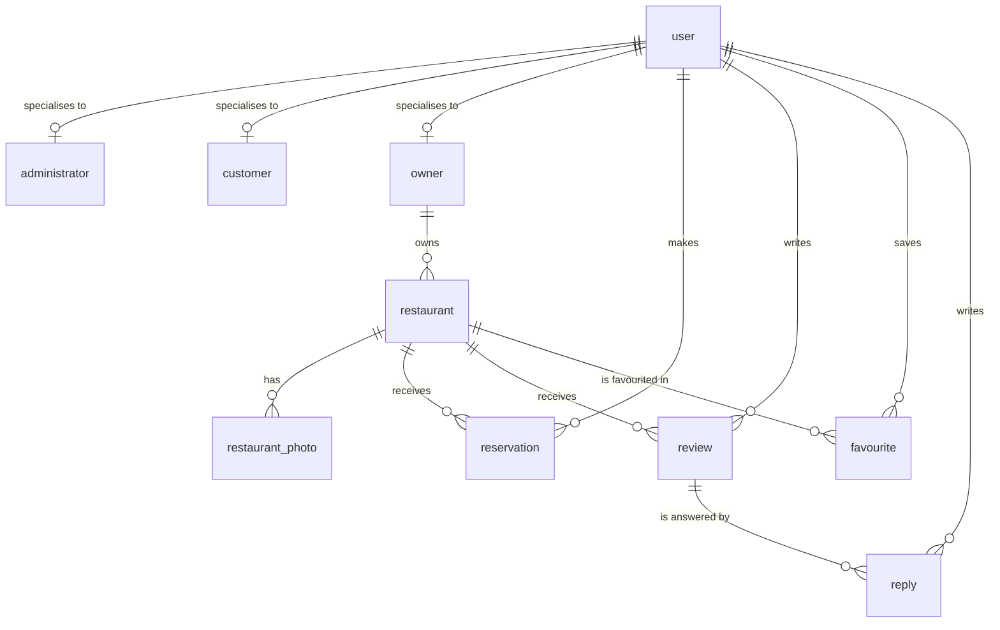

# EatZy - Restaurant Reservation Platform

A full-stack restaurant reservation platform: customers discover restaurants and book
tables, owners manage their venues and respond to reviews, and administrators moderate
the whole system. Built as a university project for LBAW (Database and Web Application
Laboratory) at FEUP, 2025/26.

## Stack

Laravel 12 on PHP 8.2, PostgreSQL, Blade templates, Docker Compose. Two-factor
authentication via `pragmarx/google2fa` (TOTP).

## Features

**Customers** browse and search restaurants, make and manage reservations, and leave
reviews on venues they have actually visited.

**Owners** manage their restaurants, capacity and availability, and reply to reviews.

**Administrators** manage users and resources, block accounts, and moderate content
through a dedicated admin area behind role middleware.

**Accounts** support registration, login, password recovery by email, optional TOTP
two-factor authentication, and full account deletion.

## Database design

Twelve tables. User roles are modelled as class-table inheritance - `administrator`,
`customer` and `owner` are specialisations of `user` rather than a role column - so
role-specific data and foreign keys stay where they belong.



The business rules live in the database rather than only in application code. The schema
defines **25 trigger and stored-function declarations**, including:

| Trigger | Rule enforced |
|---|---|
| `check_capacity_before_reservation` | a booking cannot exceed the venue's remaining capacity |
| `check_reservation_before_review_trigger` | only customers with a past reservation may review |
| `auto_complete_reservations` | reservations transition to completed once their time passes |
| `validate_reservation_changes` | edits are re-validated against the same constraints |
| `cascade_review_deletion_trigger` | deleting a review removes its dependent replies |
| `cascade_restaurant_archive_trigger` | archiving a venue propagates to its dependent rows |
| `restaurant_search_update` | keeps the full-text search vector in sync on write |

Search uses PostgreSQL full-text search over a `tsvector` column with a **GIN** index
(`restaurant_search_idx`), plus **B-tree** indexes on the review and reservation hot paths
(`review_restaurant_idx`, `reservation_restaurant_date_idx`).

## Running locally

```bash
cp .env.example .env
# generate an application key
php artisan key:generate

docker compose up -d
php artisan migrate --seed
```

The application is served at `http://localhost:8001`.

Password recovery sends real email, so it needs SMTP credentials. The project is set up for
[Mailtrap](https://mailtrap.io) sandboxes - create a free account and put your own
`MAIL_USERNAME` and `MAIL_PASSWORD` in `.env`. No credentials are committed to this
repository.

### Demo accounts

Seeded by `php artisan migrate --seed` for local use only. These exist solely in your own
local database:

| Role | Email | Password |
|---|---|---|
| Administrator | `admin@eatz.com` | `adminpass` |
| Customer | `grace@email.com` | `userpass` |
| Owner | `eve@cozy.com` | `ownerpass` |

## Team

Group project, four contributors: Igor Orlinski, Francisco Antunes, José Pedro Afonso
Martins, and Edgar Carneiro.

## My contributions

I am the second-largest contributor, with 35 of the 165 commits. My work concentrated on
authentication, authorization and the administrative layer:

- **Authentication.** Built `AuthController` and the login/registration flows, then
  migrated the password recovery flow onto Laravel's standard password-broker traits
  rather than the hand-rolled version it started as.
- **Two-factor authentication.** Added TOTP 2FA (`TwoFactorController`, `pragmarx/google2fa`)
  and the enrolment flow on the user model, including fixing a PostgreSQL boolean type
  mismatch the feature exposed.
- **Authorization policies.** Wrote the `Restaurant`, `Review` and `Reply` policies that
  restrict CRUD to venue owners and administrators.
- **Administration area.** Built `AdminController` and the role middleware behind it -
  user blocking, user editing, and resource management.
- **Account deletion.** Implemented the hard-delete path across the schema, including the
  SQL-side rework needed for dependent rows to be removed correctly.
- **Domain model.** `User`, `Restaurant`, `Reservation` and `Review` models and their
  relationships; `User.php` is the file I touched most across the project.
- **Schema and seed data.** Contributed to `creation.sql`, `population.sql` and the
  database seeder.

Full history: `git log --author=sillss1`

## Note on this repository

This is a standalone copy of a group project originally hosted on the university's GitLab,
published to document my own contribution. The full commit history and every author's
attribution are preserved. Credentials that were committed to the original repository have
been purged from this copy's history and rotated.
